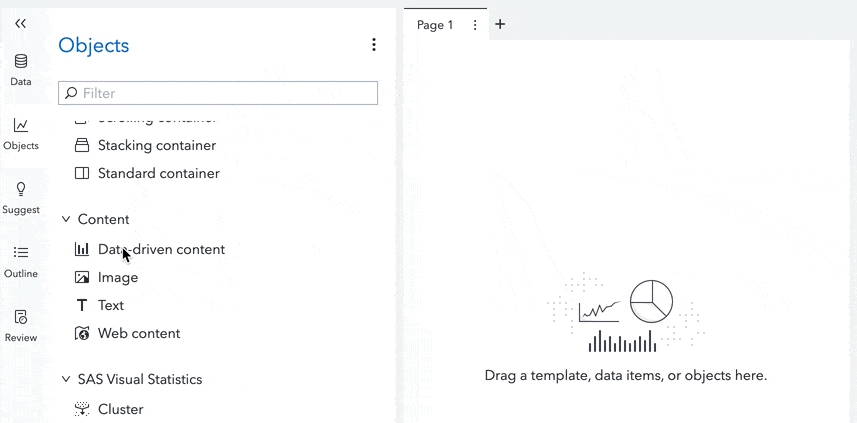
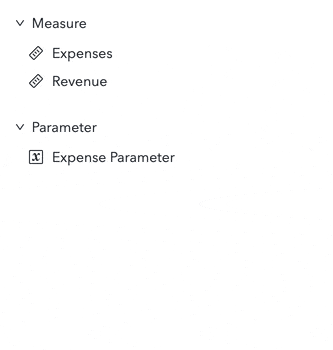

# SAS Visual Analytics Data-Driven Content Dynamic SVG

This project provides a SAS Visual Analytics (VA) data-driven content object that uses annotations on provided data and SVG file to create a dynamic illustration that responds to data updates. It is a wrapper around the [Dyanmic Vector Graphics](https://github.com/jrbenson/dynamic-vector-graphics#readme) project.

## Quick Start Guide

To use this system in a Visual Analytics report you must use a Data-driven content object.

**Adding a Data-driven Content Object** 

Then you must provide a URL to the VA Data-driven Content object's "URL" option. This URL is to the HTML page that runs the dynamic SVG and takes an "svg" parameter which is a URL to the desired SVG file. The SVG URL must be resolvable from the context of the HTML page. Using the samples provided in this repository for example either of the following will work:

- `https://jrbenson.github.io/sas-va-ddc-dynsvg/?svg=https://jrbenson.github.io/sas-va-ddc-dynsvg/svg/airplane-top.svg`
- `https://jrbenson.github.io/sas-va-ddc-dynsvg/?svg=../svg/airplane-top.svg`

**Setting URL of VA Data-driven Content** 

Any measures in the data that will be used to dynamically alter the SVG need to be annotated with their minimum to maximum data range.

**Adding Range Annotation to Data** 

And finally the data must be assigned to the "Variables" role of the Data-driven content object.

**Adding Range Annotation to Data** 

## Annotating an SVG File

To make your an SVG file dynamic it must be correctly annotated. Information on the annotation syntax may be found on the [Dyanmic Vector Graphics](https://github.com/jrbenson/dynamic-vector-graphics#readme) project.